# 计算机图形学概述

## 什么是计算机图形学

合成与操作视觉信息

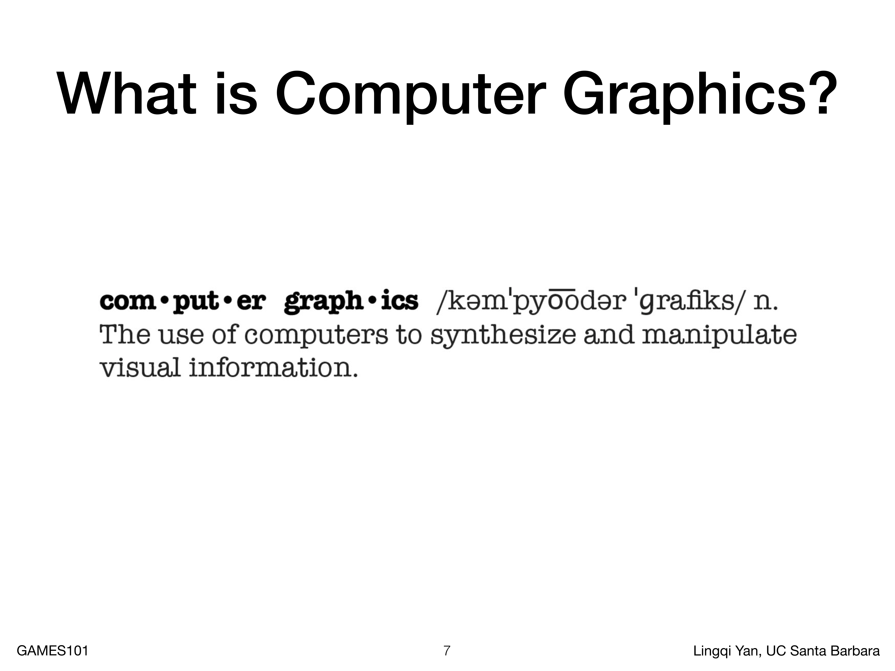

## 图形学应用

怎么去从技术角度判断一个画面是否是好的呢？一个简单标准就是看这个画面是不是足够亮，这个与图形学中或者说渲染方面的一个关键技术，叫全局光照，如果全局光照做得好，那么整个画面会比较亮，看起来就很舒服，如果画面不够亮，就会显示出技术不足，比如说下图所示的《只狼》游戏画面

当然，还有其他的游戏，下图所示的游戏《战地3》跟《只狼》完全不是一个风格，更偏向于卡通风格，但是为什么我们看起来是卡通风格？在计算机图形学中卡通风格是如何实现或者定义的呢

当然，还有一些电影也会使用计算机图形学技术，比如说《黑客帝国》中的**特效（Special Effect）**，使得画面看起来非常真实，不过特效只是一种图形学的简单应用，比如说实现爆炸、子弹破空等效果

还有就是实现面部捕捉和重建的特效

还有一些动画风格的，其中有实现毛发效果的地方，或者说进行逼真的渲染（衣服随风而动这样子）

以及设计方面，使用计算机辅助设计，如下图所示，左边就是CAD设计出的车辆，并且可以模拟物理环境的光线，看起来非常逼真（可能还可以进行物理模拟）

或者进行家居方面的设计与生成，以此提前看到家居的展示效果

可视化方面也是一个应用方向，图形学就是一种操纵视觉信息的技术，自然可以进行数据的可视化

与可视化相关的一个领域就是虚拟现实，当然这个领域和增强现实有紧密关系

虚拟现实，指的是你看到的东西全部是由电脑生成的虚拟物体，看不到实际的物体；增强现实指的是你可以看到现实中的物体

模拟也是一个应用，比如说模拟视觉上的效果，或者基于物理进行模拟，依靠各种运算完成模拟，这种技术也可以称为仿真，比如说下图中的黑洞模拟

GUI（Graphical User Interfaces）也是一种设计用户界面的技术，近年来开始独立了

还有一种神奇的领域就是字体设计，有的字体不论怎么放大，都是光滑连续的，这就是矢量图

## 怎么学习计算机图形学

需要去研究和理解各种各样的材质，才可以真实的显示出来

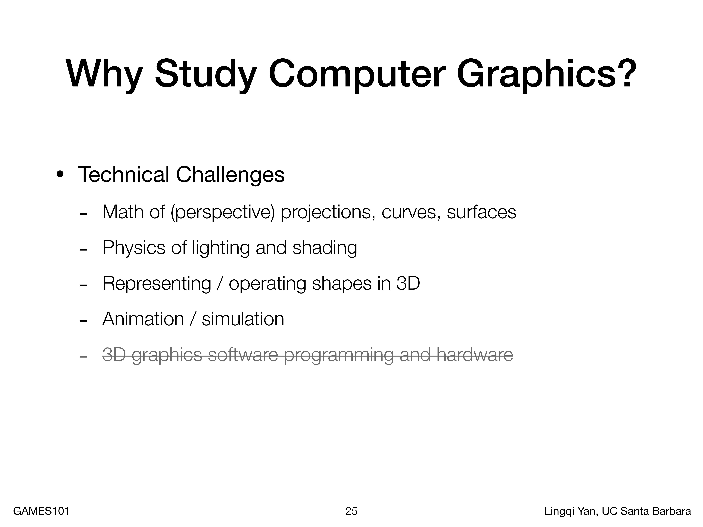

## 内容

- 光栅化（Rasterization）
- 曲线和曲面（Curves and Meshes）
- 光线追踪（Ray Tracing）
- 动画/仿真（Animation / Simulation）

不过，OpenGL不等于图形学，OpenGL只是实现图形学的一个API

## 光栅化

光栅化，就是将几何形体（geometry primitives）投射到屏幕上，主要是做投影

在这里解释一下实时的概念，实时就是每秒生成三十张以上的画面（或者三十帧），如果不能满足这个，那么就称为离线

## 曲线和曲面

如何表示光滑的曲线曲面，如何通过细分的方式得到更复杂的曲面，或者说曲面如何变化才可以保持物体的拓扑结构这些

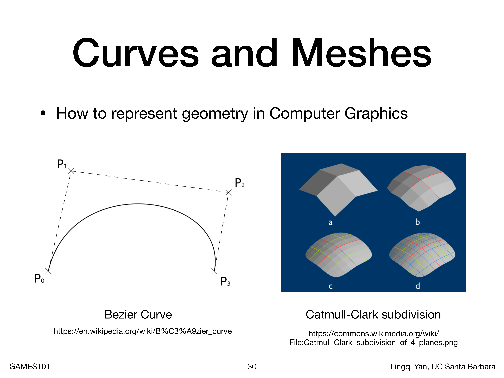

## 光线追踪

光线追踪的基本原理是逆向追踪光线。在现实中，光源发出光线，经过反射和折射，最终被我们的眼睛（或者相机）捕捉到。在光线追踪中，我们从相机（或观察者的视点）出发，逆向追踪光线，直到找到光源。这个过程中，光线可能会在物体上反射，或者通过透明物体折射。通过这种方式，我们可以计算出在特定角度看到特定物体时，它应该显示的颜色和亮度。

## 动画/仿真

## 与计算机视觉的区别

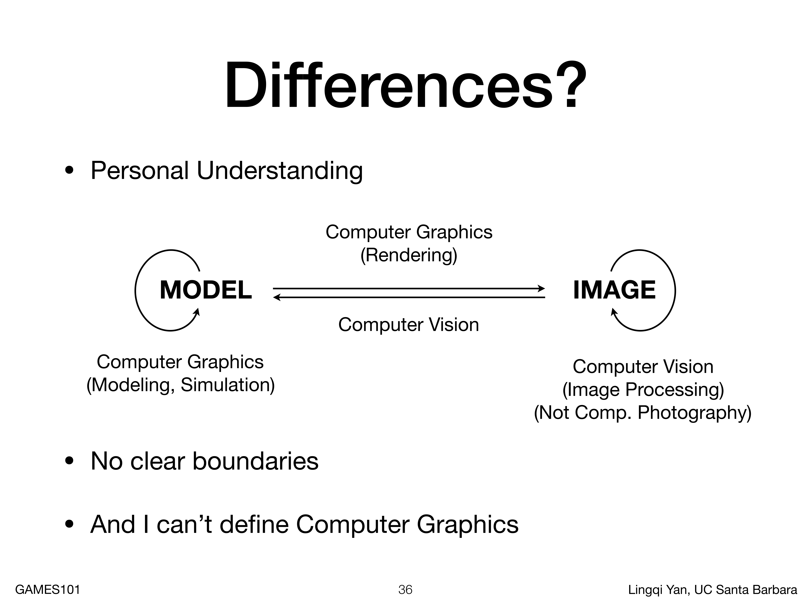

图形学侧重于描述现实世界的模型（如何去描述三维世界），视觉就是通过一张照片去进行识别与理解（如何去理解三维世界）

# 图形学中的线性代数

## 向量

向量，物理上也叫做矢量，带有方向和长度信息，而且我们不关心向量的绝对的起始位置

还有长度为一的向量就是单位向量

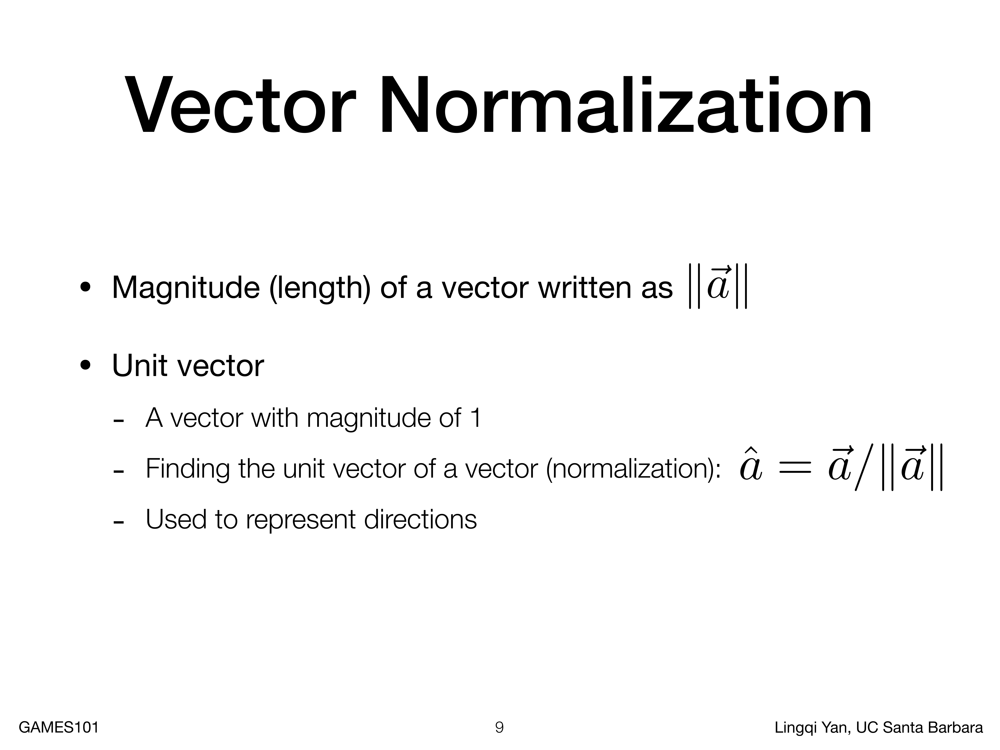

还有向量的运算，比如说几何角度下的平行四边形法则或者三角形法则，代数角度下的坐标数值相加

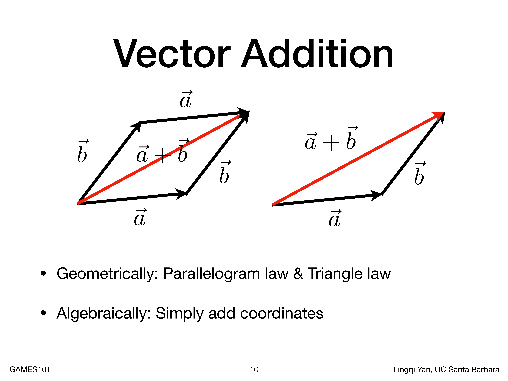

## 向量运算

### 点乘（Dot Product）

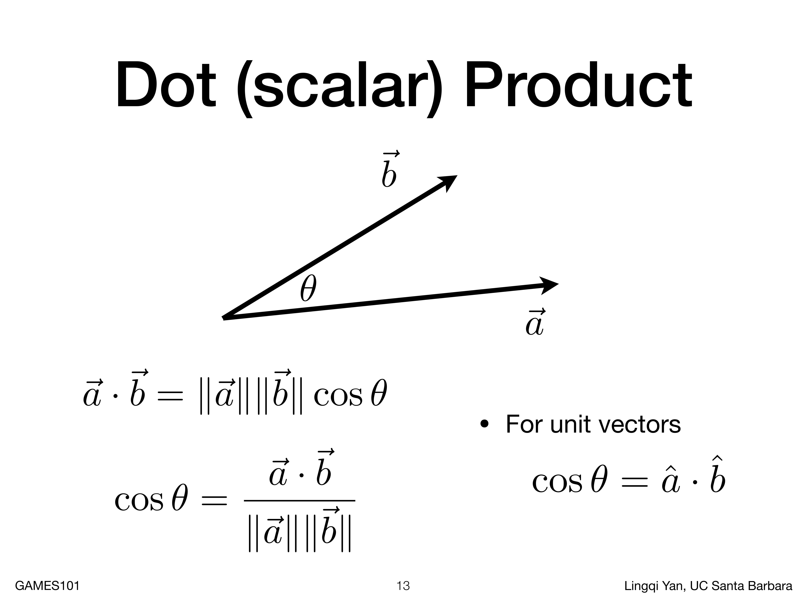

帮助计算向量夹角

### 点乘在图形学中的应用

用于计算两个方向或者向量之间的夹角，尤其是在光照模型的时候，计算光从什么角度照射和物体表面法线这些

然后还可以计算向量的投影

还可以计算两个向量的垂直或者投影，或者两个向量的方向多么接近，以及定义向量方向

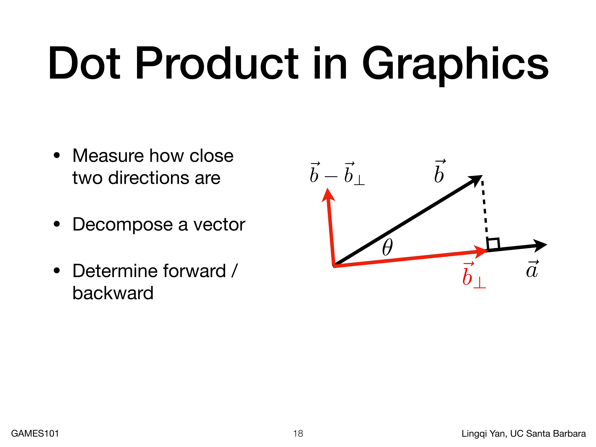

### 叉乘（Cross Product）

代表了两个向量的有方向的面积，可以用来建立三维空间中的坐标系

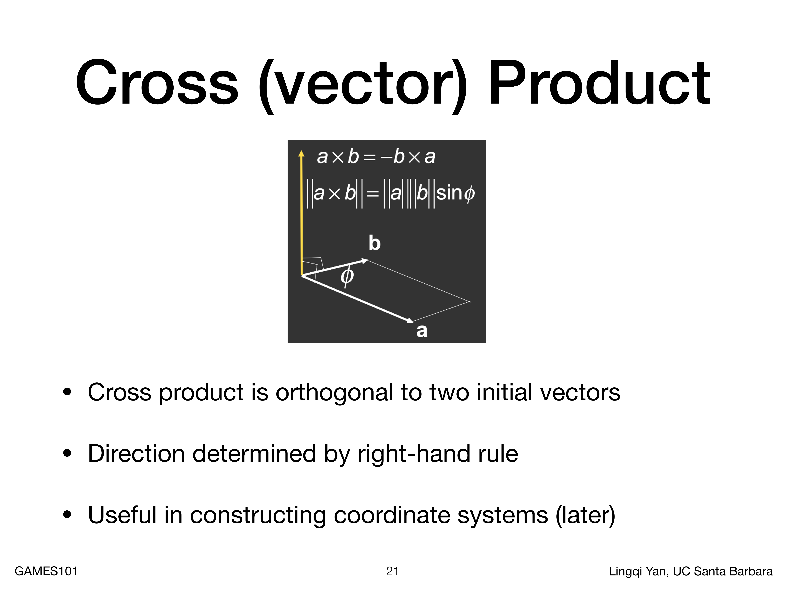

在这里我们假定所有的都是右手坐标系，实际上OpenGL是右手系，Unity是左手系

图形学中叉乘的作用就是判断左和右，内和外（实际上这是一个概念）

比如说向量$\vec{a}$和$\vec{b}$，我们可以通过判断其相对位置关系，比如说向量的叉乘是正的，那么$\vec{b}$在$\vec{a}$的左侧，或者说是逆时针方向

如果想判断内外，这一点应用广泛，比如说一个三角形（上图右边所示，点是逆时针排列的），我们判断一个点是否在三角形内部，可以先使用$\vec{AB}\times \vec{AP}$这样，判断点P是否在AB左边，然后依次计算P是否在BC和CA左侧，如果都是，那么P点在三角形内部

一般的来说，三角形的点不一定按照什么顺序排列，所以只需要判断点是不是一直在三条边的左侧或者右侧就可以，后面在光线追踪中会涉及

### 正交坐标系

如果我们定义了三个向量，满足模为1，相互正交，并且满足叉乘，那么就可以得到一个右手系正交坐标系，并且可以分解任何向量

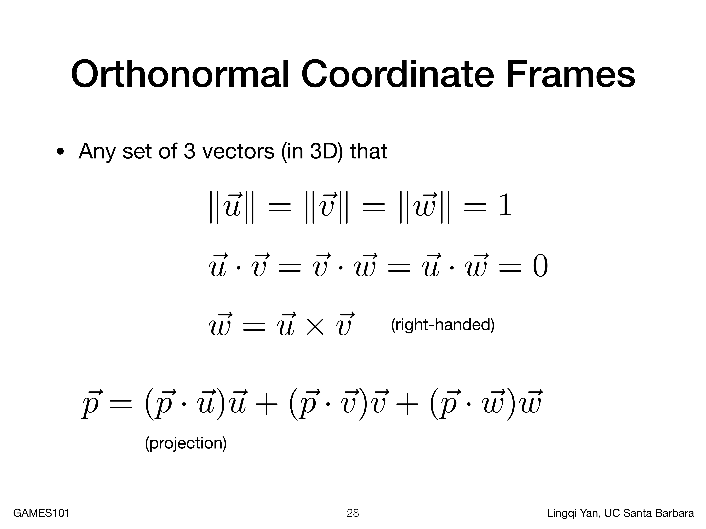

### 矩阵乘法

可以用来做坐标变换操作

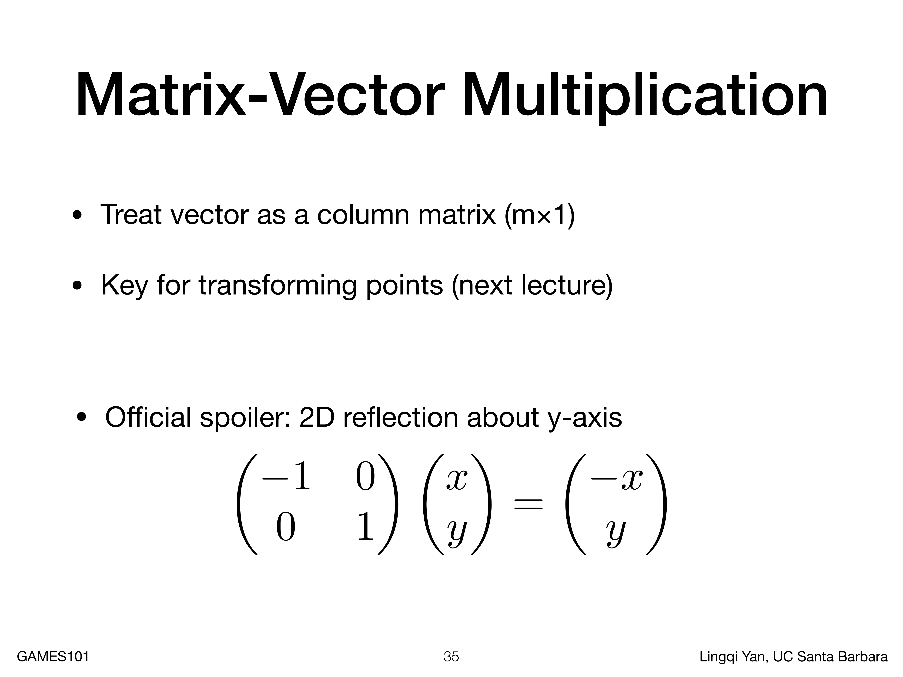

当然还可以使用矩阵表示叉乘运算

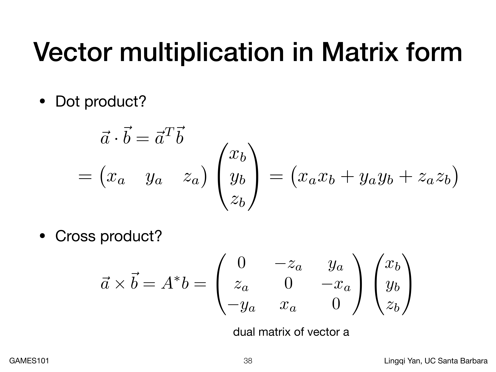