# 光栅化

## 回顾

透视投影转正交投影保证近和远两个平面不变（或者说变成和近平面一样大），然后我们使用XYZ三轴的覆盖表示空间中立方体的范围，X覆盖左右，Y覆盖上下，Z覆盖远近

在转化的时候，我们怎么定义这个视锥呢？我们从相机出发，假设我们看到的就是近平面，那么可以为其定义宽度和高度还有**宽高比（Aspect Ratio）**，当然还有另一个概念就是Field-of-View（fovY），垂直的可视角度（下图红色虚线所示）就是fovY

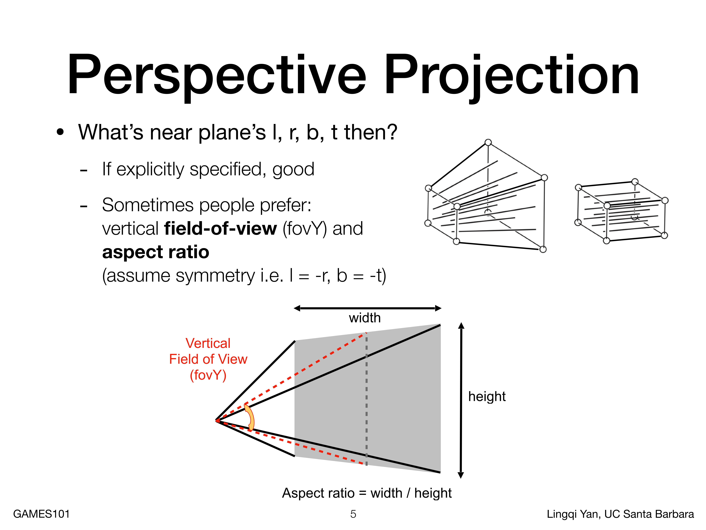

我们可以将这些概念进行迁移

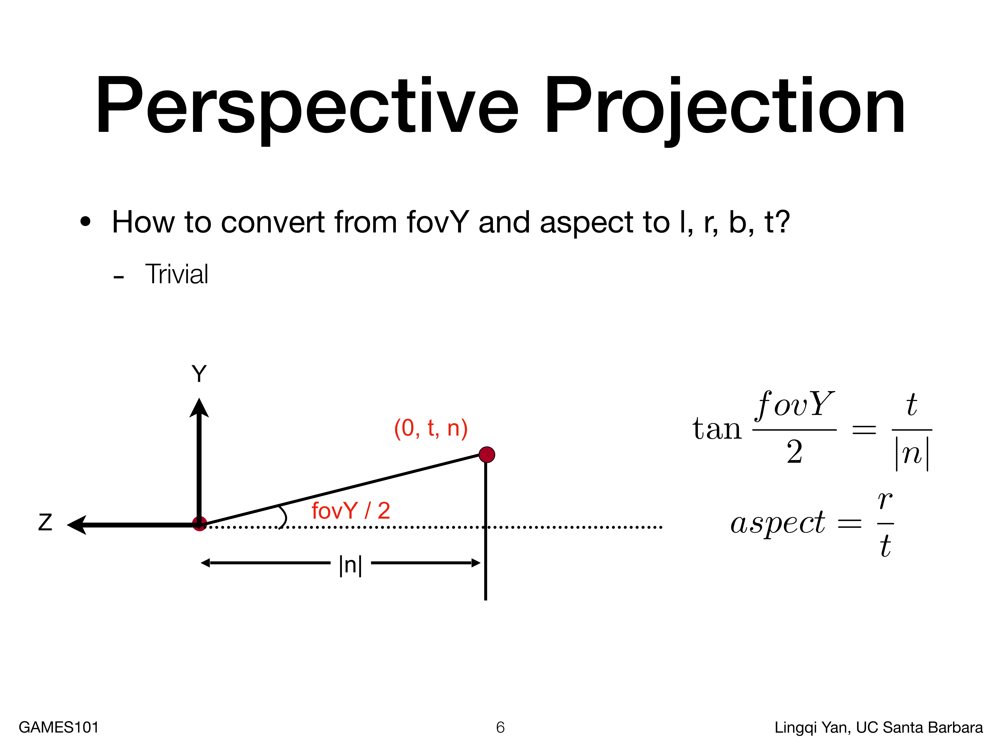

我们可以计算可视角度等

## 屏幕

### 基础概念

我们前面在MVP（Model View Projection）中有一种投影变换挤压为正交投影的方法，并且提到了标准立方体，但是立方体如何显示在屏幕上呢？在实现这个之前，就需要去了解屏幕的概念

图形学中，我们认为屏幕就是一个二维数组，数组中的元素就是一个**像素（Pixels）**，分辨率就是数组的形状（或者说屏幕大小），比如说1920x1080，并且，屏幕是一种典型的光栅成像设备

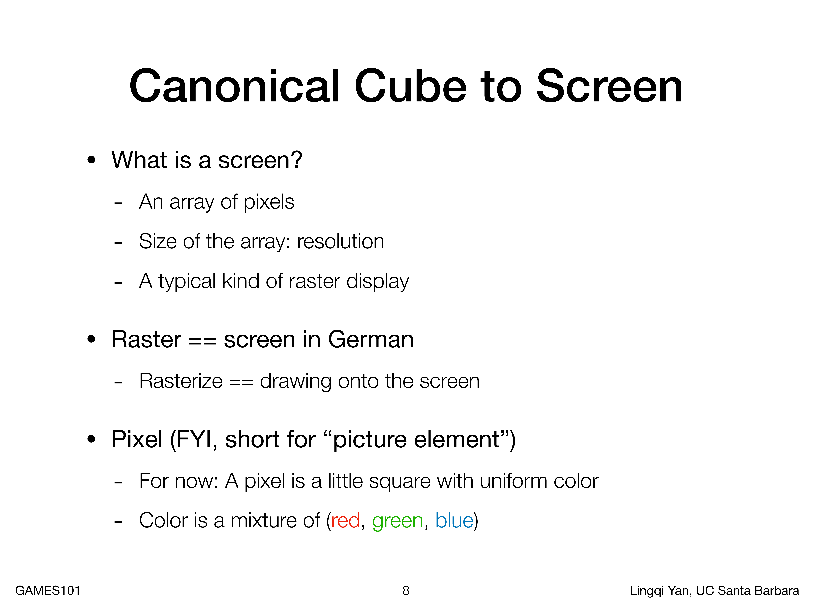

光栅化就是把事物画在屏幕上

我们这里认为像素就是一个带有颜色的小方块，尽管像素实际上很复杂，颜色是红绿蓝的离散值的混合（RGB像素）

### 屏幕空间

屏幕空间就是一个屏幕上建立起来的坐标系，如下图所示，我们认为左下角是屏幕空间的原点，然后定义像素的坐标（或者说下标、位置）是整数的形式，下图中蓝色方块的坐标就是（2，1），实际上我们使用的是像素方块左下角的坐标定义像素坐标，而不是像素方块的中心坐标（2.5，1.5）

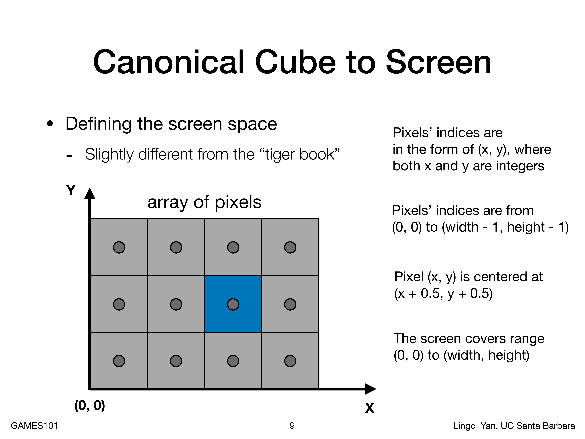

然后我们在三维空间中有一个立方体，这个立方体如何显示在二维的屏幕上呢？我们先不管Z，先看XY方向，将其从标准正方形变到整个屏幕上

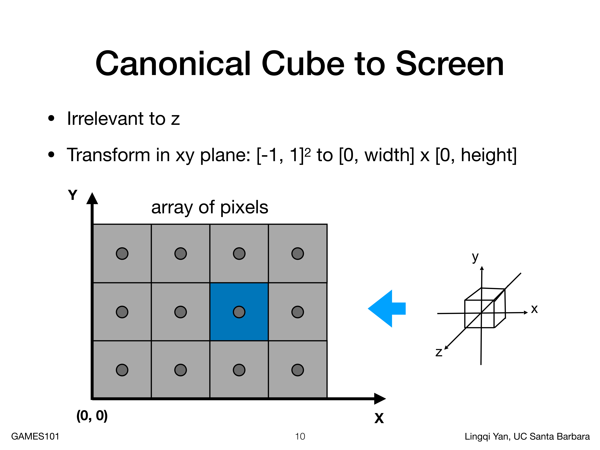

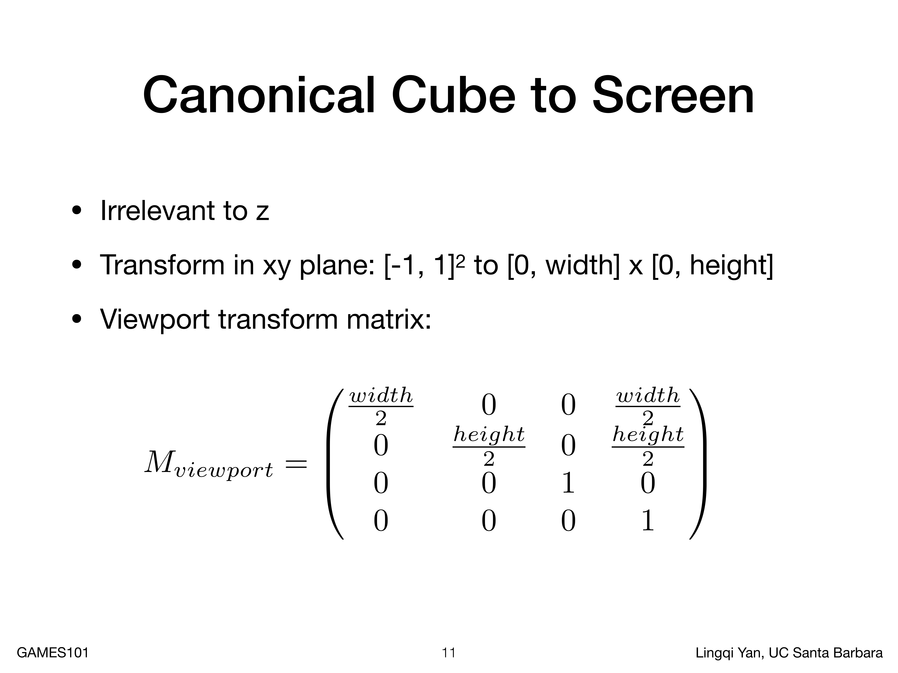

## 其他成像设备

CNC制造技术就是一种在金属上绘制的技术

### 阴极射线管

这是老式电视机的成像技术，电子管发射阴极粒子流，然后经过电极偏转，打到显示屏上就可以成像（通过扫描成像），如下图所示

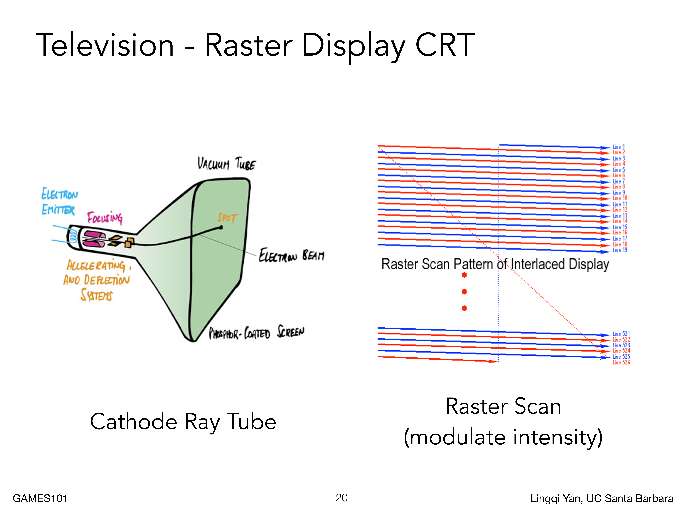

有一种压缩成像的方法，就是隔行扫描，但是这会造成画像割裂的情况

### 帧缓冲器： 光栅显示的内存

现代的显示器是如何进行显示的呢？在显示器中都有显卡，显卡中有显存，显存中的一个区域，其中的内容映射到屏幕上就完成了显示

现代的显示器通常是LCD和OLED等，比如说计算器的显示屏就是一个分辨率很低的LCD，手机的显示屏就是一个高分辨率的设备，甚至可以超过人视网膜的分辨率（超过的就称为视网膜屏幕）

#### LCD：液晶显示器（Liquid Crystal Display）

液晶显示器的工作原理主要基于液晶材料的特性。液晶是一种特殊的物质，它的状态介于固态和液态之间。在电场的作用下，液晶分子可以改变排列方式，从而改变通过它的光线的偏振状态，进而控制单个像素的显示。

液晶显示器（Liquid Crystal Display, LCD）使用液晶材料和光的偏振原理来显示图像。这个过程涉及到一些相当复杂的物理和化学知识，但在最基本的层面上，我们可以简化为以下步骤：

1. **背光系统发光**：LCD本身不发光，因此它需要一个背光系统提供光源。这个光源通常来自于LED或者冷阴极荧光灯（CCFL）。
2. **通过第一个偏振片**：背光发出的光首先通过一个偏振片。偏振片只让特定方向的光线通过，例如，只让垂直方向的光线通过。经过偏振片之后，光线变成了线性偏振光。
3. **通过液晶层**：偏振光然后通过液晶层。液晶层中的每个像素都可以通过改变电压来控制液晶分子的排列，从而改变光线的偏振状态。
4. **通过彩色滤镜**：液晶层之后是彩色滤镜，每个像素都有红、绿、蓝三种颜色的滤镜。这些滤镜可以分别对红、绿、蓝光进行过滤，以产生不同的颜色。
5. **通过第二个偏振片**：最后，光线通过第二个偏振片。这个偏振片的偏振方向与第一个偏振片垂直，例如，只让水平方向的光线通过。因此，只有当液晶分子将光线的偏振方向转为水平时，光线才能通过第二个偏振片。否则，光线会被阻止，像素看起来就是黑色的。
6. **形成图像**：通过控制每个像素通过的光线的亮度和颜色，LCD就能显示出各种各样的图像。

原理本质上就是一种材质也就是液晶，可以实现：通过施加电压的大小，可以改变某一颜色透光量的多少，从而模拟RGB不同颜色的组合

液晶显示器的这种工作原理使得它能够在非常薄的层面上显示高清晰度的图像，而且能耗也比许多其他类型的显示器要低。然而，这种工作原理也决定了液晶显示器的一些缺点，例如视角有限、响应时间较长、黑色不够深等。

#### LED（Light emitting diode）：发光二极管

就是发光和不发光两种情况

#### 电子墨水屏

通过不同的电压来控制像素的黑白情况，但是缺点是刷新率低

电子墨水屏使用微胶囊或微囊技术。每个微胶囊都像一个微型沙漏，内部填充有两种不同的颗粒。这两种颗粒通常是黑白两色，一种是带正电的白色颗粒，另一种是带负电的黑色颗粒。

当在微胶囊上施加电压时，带电颗粒会根据电场的方向移动。例如，如果上部电极带正电，那么带负电的黑色颗粒就会被吸引到上部，而带正电的白色颗粒则会被排斥到下部，于是从屏幕上看到的就是黑色。反之，如果上部电极带负电，那么就会看到白色。

在电子墨水屏中，每个像素就是一个微胶囊，通过控制每个像素的电场，就可以控制屏幕上的图像。此外，电子墨水屏有一个重要的特性，那就是它是双稳态的。也就是说，当改变了颗粒的位置后，即使去掉电压，颗粒也会保持在新的位置。这就是为什么电子墨水屏在静态显示的情况下几乎不消耗电能的原因。

## 光栅化：在光栅显示屏上绘图

我们前面提到了一些成像设备，那么如何在这些成像设备上进行显示呢，同时也提到了三维空间中的点和形状如何投影到二维平面上，就是把多边形拆成像素（也就是光栅化的过程）

- 最基础的多边形，可以表示其他的多边形
- 三角形肯定是一个平面并且内外定义清晰
- 只需要定义三角形顶点的不同属性，那么内部就是渐变的，可以得到内部任意点的属性

我们在空间中有一个三角形，那么我们在屏幕空间中就只看XY坐标，然后我们就需要找到一个方法将其变为屏幕上像素显示的图像，这里就有一个光栅化中核心的概念，就是判断光栅中的像素和三角形位置关系，或者说考虑像素的中心点与三角形的位置关系

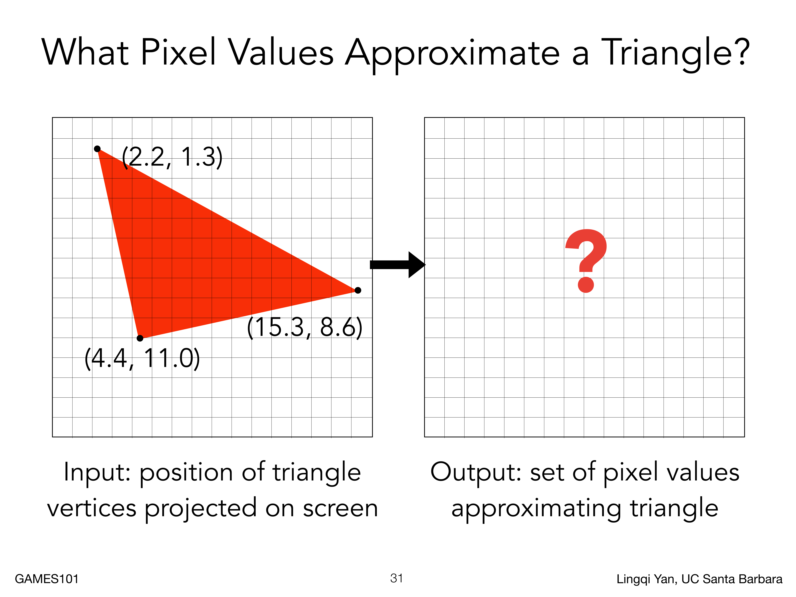

### 采样方法

这里有一个简单的方法，就是采样，假设有一个连续函数，我们在不同的地方去采集它的值，或者说采样就是将连续函数离散化的过程

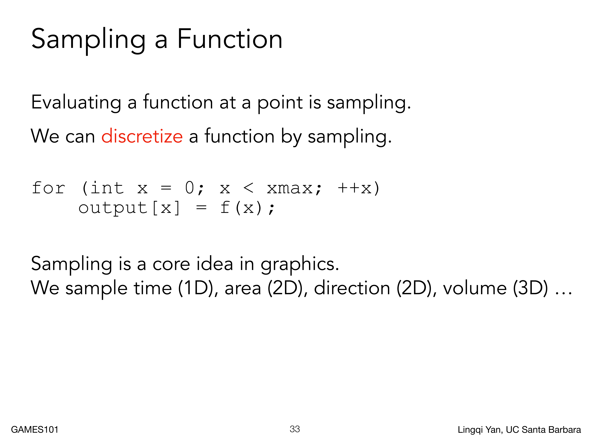

采样是很重要的概念，我们这里的采样指的是利用像素中心对屏幕空间进行采样，后面还有对其他方面的采样

在三角形中，我们判断像素中心是否在三角形内部，这个也是一个函数，我们定义这个函数为``inside(t,x,y)``

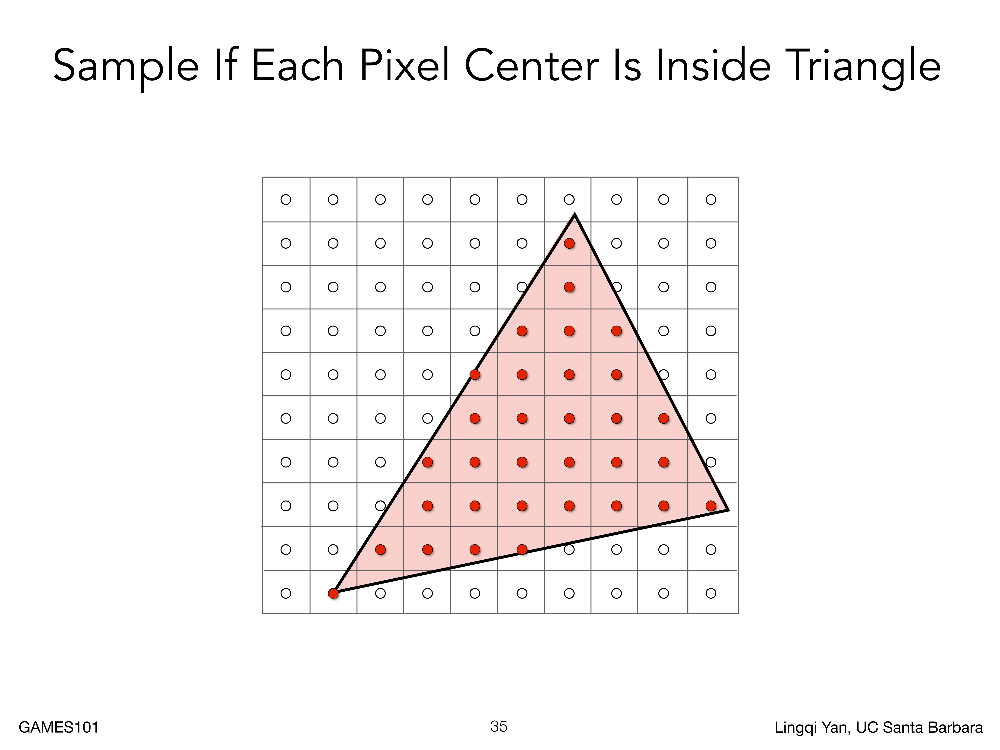

这个函数的返回值是1或者0，然后就可以判断一个像素是否一个被填充

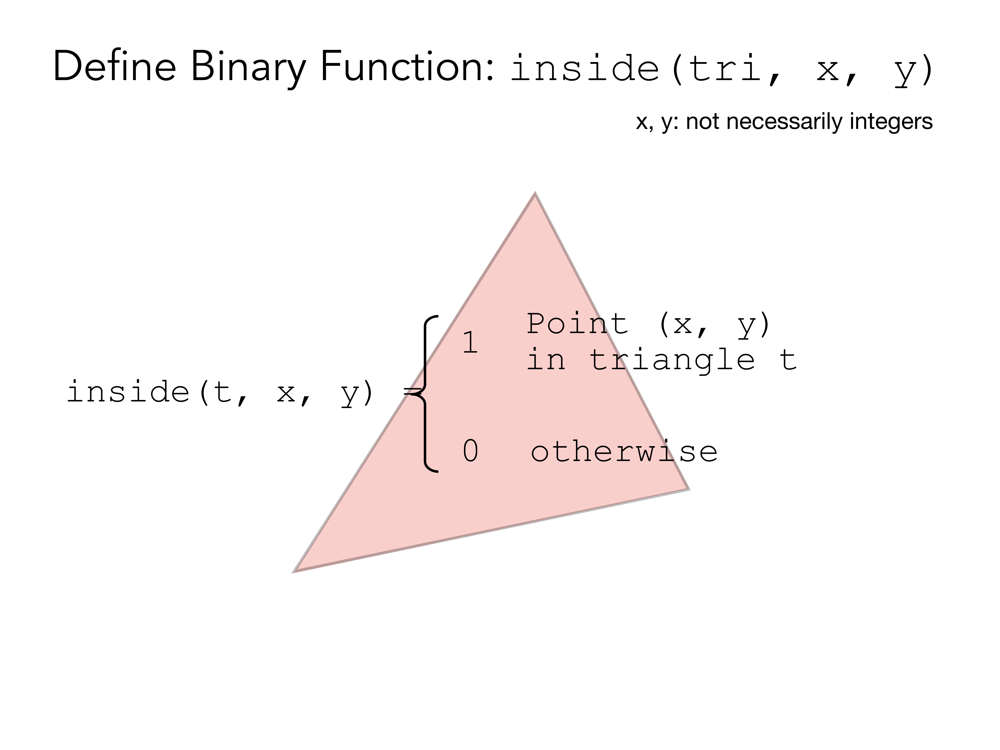

我们回想如何判断点在三角形内外，答案就是点积或者叉乘

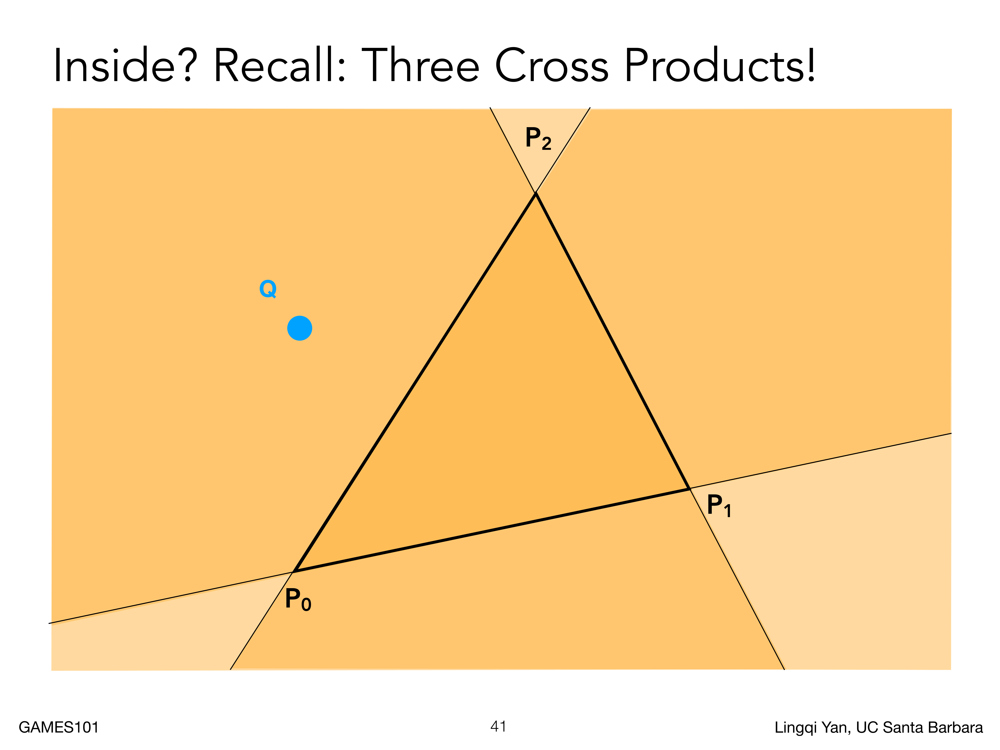

不过总有一些特殊情况，比如说点恰好在三角形的边上，甚至在多个三角形的边或者顶点上，那么这样点算在哪个三角形上呢？不过我们在这里选择不做处理

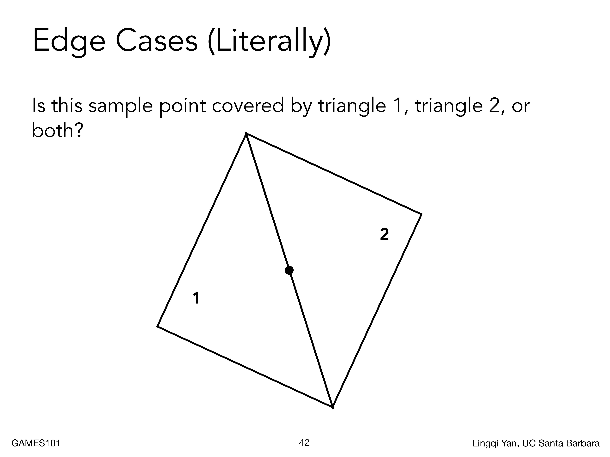

不过，我们也不可能对屏幕上每个像素都检查一遍，这样太浪费计算资源了，尤其是一个三角形可能只覆盖屏幕上一小块区域的时候，所以我们有一种节省计算资源的方法，就是设置一个边界框（如下图所示），其范围就是顶点的最大最小值确定的，完全包裹住三角形，这样在光栅化的时候只需要在这个边界框中计算就可以，不再边界框中的点更不可能是三角形的填充像素

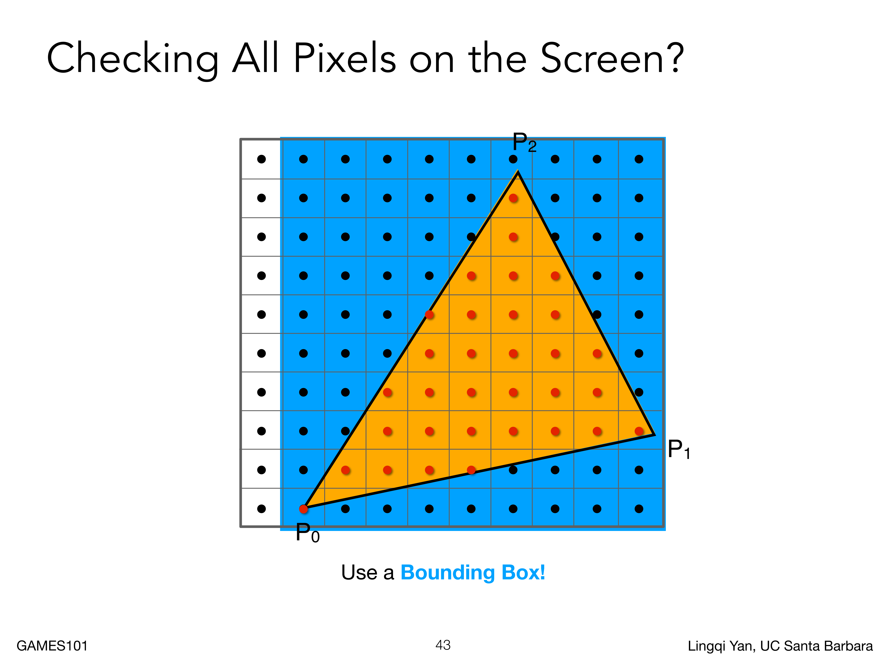

然后可以进行加速，比如说下图这种方式，每一层都从每一行像素的最左开始和最右结束，可以进一步节省计算资源

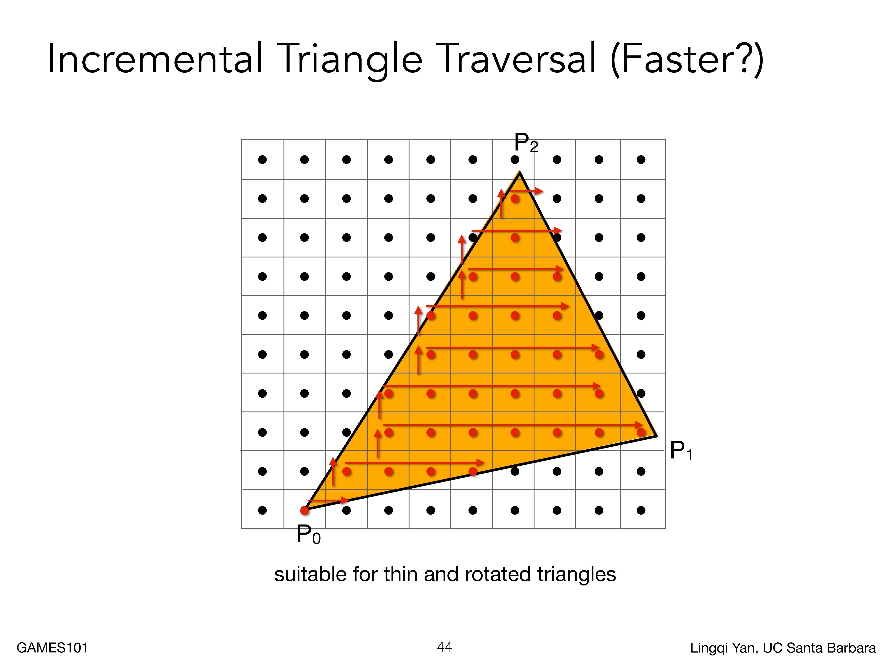

### 实际屏幕的光栅化

当然前面只是理论，具体的屏幕显示如下

当然仔细分析的话，会发现右边绿色的像素更多，这是因为人眼对绿色的敏感度更高

当然在其他的成像设备上可能会有所区别，比如说在彩色打印上，可能会出于节省颜料的目的去减少颜色

当然，我们在这里仍然认为每个像素的颜色是一致的（或者说是均匀的）

如果我们使用采样的方法进行了显示，那么会出现下面的效果，这与我们想要的效果相差甚远，这里有很多锯齿，这也是光栅化致力于解决的问题（抗锯齿和反走样），出现的原因就是像素本身有一定的大小，并且采样率对于信号来说是不够高的

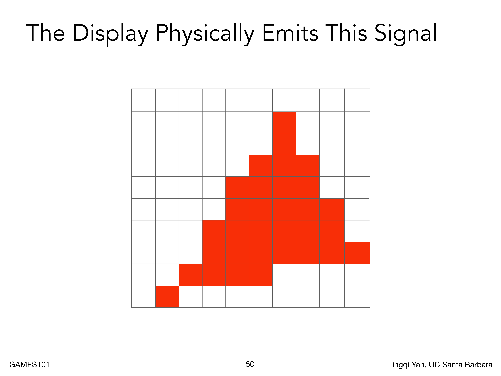

接下来就会去讲解如何完成抗锯齿和反走样问题，并且在信号频率角度去理论分析成因

光线叠加会更加强烈明亮，但是色彩叠加会变暗，所以有聪明的画家发明了点彩法，用很小的紧密的点间隔画上黄色和蓝色，实现高亮饱满的绿色

# 抗锯齿

上面我们可以看到，分辨率低的情况下会有很严重的**锯齿（学名叫Aliasing，走样）**

## 采样理论

采样是图形学中一个广泛使用的理论，不仅可以在空间上采样，也可以在时间上进行采样，比如说视频，实际上视频不是连续的，也是一系列在连续时间上采样的图片

同样，采样也会有很多的**错误或者我们不希望看到的结果（英文对应于Artifact）**，比如说锯齿、摩尔纹和车轮效应

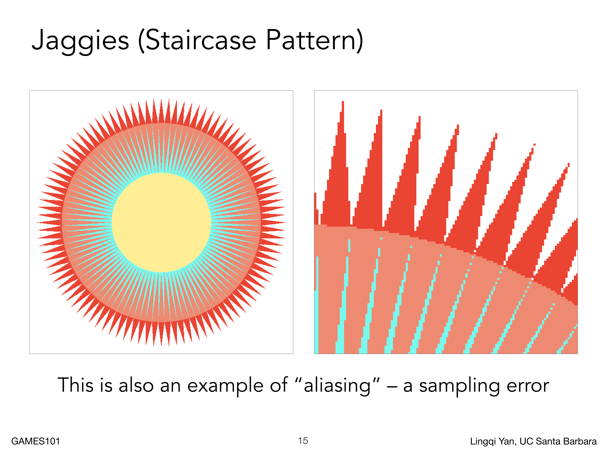

摩尔纹（Moiré pattern）是一种在重叠的规则模式中经常出现的视觉现象，当两个相似的图案（例如网格或线条）重叠，但相对于彼此稍微偏离或旋转时，就可能产生摩尔纹。摩尔纹表现为明暗交替的条纹或环形图案。

在计算机图形学中，摩尔纹现象经常出现在纹理贴图（texture mapping）的过程中。当需要将高分辨率的纹理映射到低分辨率的图像上时，如果没有采取适当的采样和滤波策略，就可能产生摩尔纹。因为在这个过程中，原始纹理的高频信息可能超过了目标图像能够表示的频率，从而产生了摩尔纹现象。这就像在数字采样中没有遵循奈奎斯特定理（Nyquist Theorem）所产生的混叠现象。

车辆效应就是旋转物体上可以看到不同花纹

产生这种情况的原因，就是信号变化太快了，采样速度跟不上

## 抗锯齿方法：采样前模糊化（或者预先滤波）

我们对三角形做一个模糊操作，将其变为一个模糊的三角形，然后进行采样，这样，有的采样点就是在模糊的地方采样，是浅红色，有的采样点在三角形中心采样，是红色，这样就可以解决一些锯齿化问题

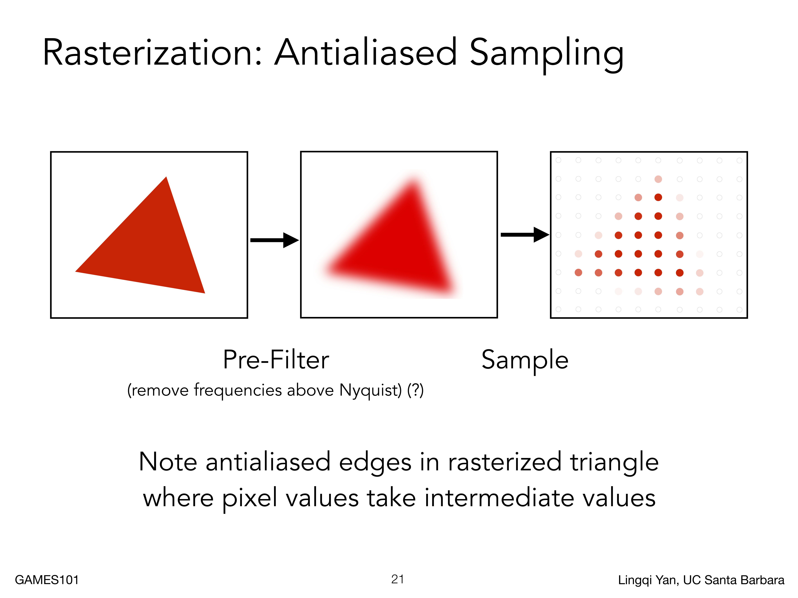

如下图所示，可以看到，使用这种方法处理之后，锯齿化程度降低了

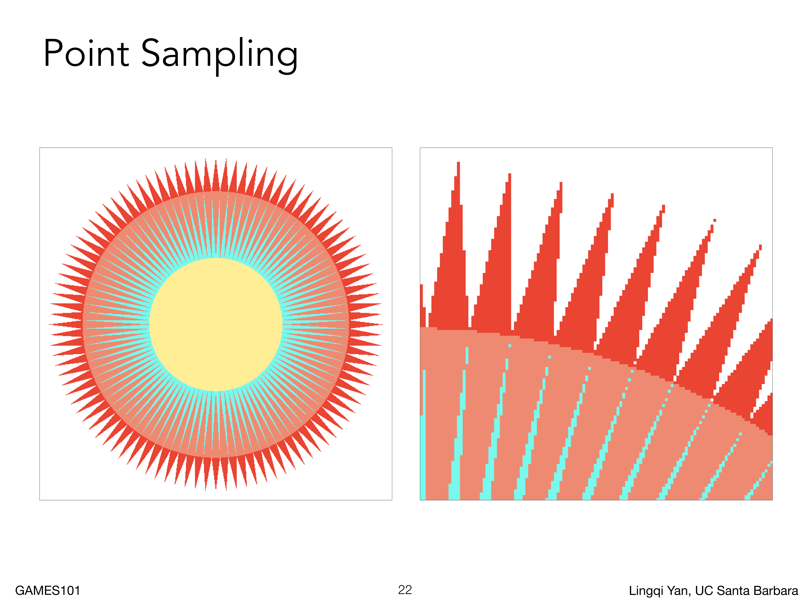

直接对比也可以看到，效果比较明显

## 模糊操作原理

任何信号都可以分解为若干不同频率的基本的正弦函数和余弦函数的叠加

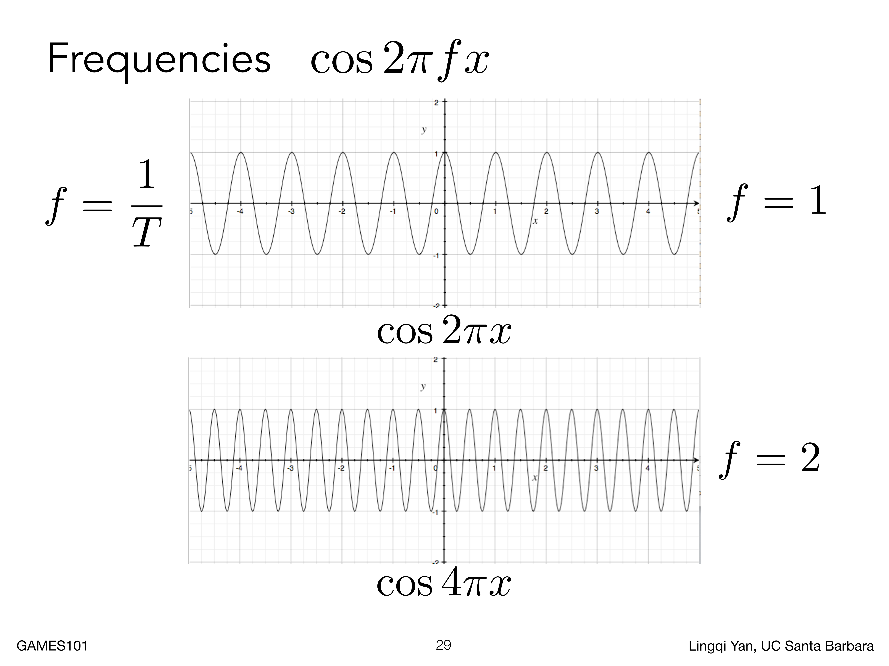

我们可以使用傅里叶变换获得不同频率的基本信号的系数

可以看下图，有五个不同频率的基础信号，我们使用相同的采样率进行采样，我们发现，我们对于过高频率的信号，采样率低的话就无法恢复信号

我们可以看下图，信号频率过高，采样率低，就无法恢复，只能恢复为一个低频信号，会出现两种信号采样结果一致，无法区分

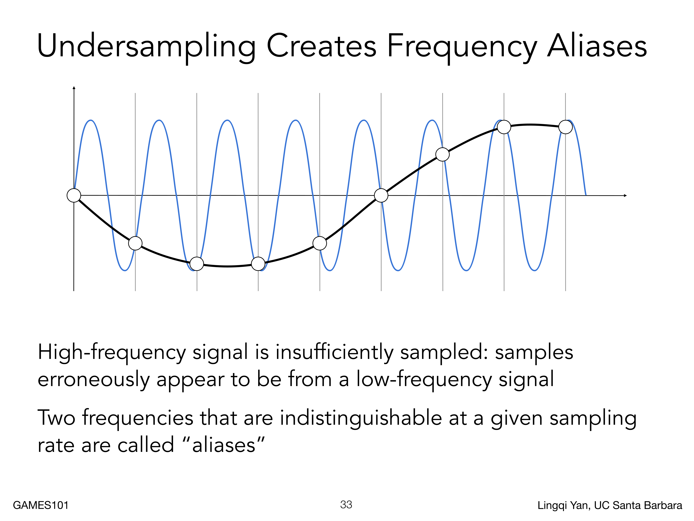

滤波，实际上就是得到某个特定频率范围的信号，不是这个频率范围的信号会被剔除

傅里叶变换的作用就是把信号从时域变到频域

下图所示，对左图进行傅里叶变换，将空域变为频域，即右图，右图中心就是最低频的区域，周围就是高频的区域，可以看到，左图的信息集中在低频信息上

假如我们使用滤波器，将低频信号滤除，就会有下图的情况，我们发现，高频信号主要是边界，这是因为高频信号表示图像中变化比较剧烈的地方，也就是边界

如果我们剔除高频信号，保留低频信号， 就会出现这种情况，图像变模糊了，边界消失了

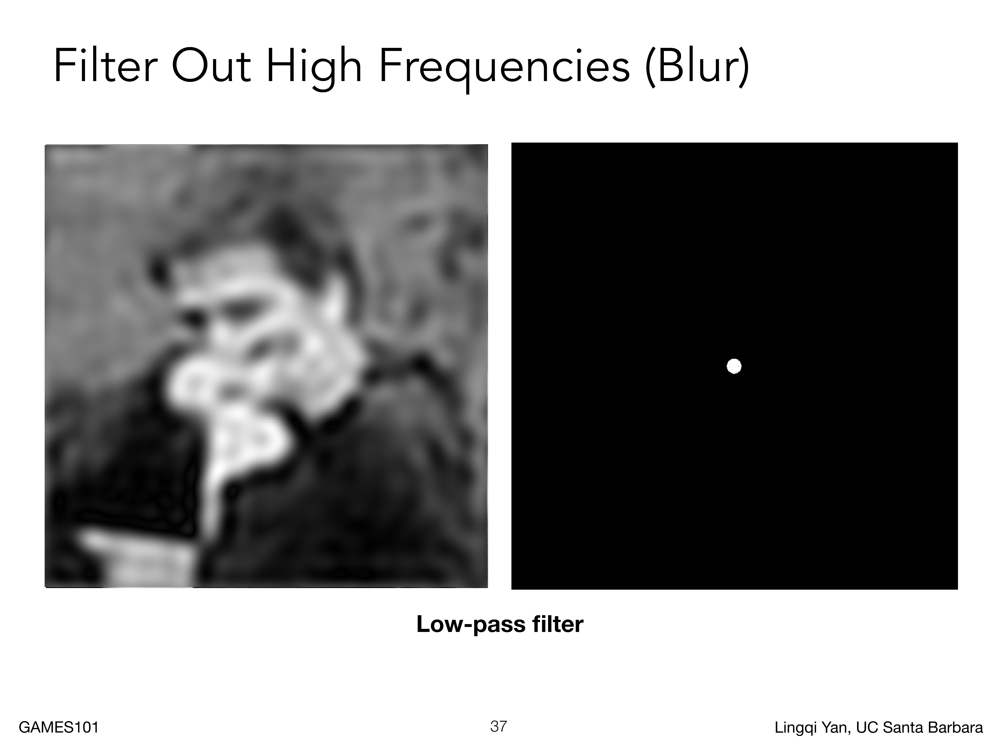

还可以只保留中间频率的信号，就可以提取到一些不怎么明显的边界区域

实际上，卷积就是滤波操作，比如说下图，使用一个这样的卷积核进行卷积，就可以完成一个模糊操作

### 采样就是在重复频域内容

如下图，a是原信号，b是其频域，在a上采样就好比是乘以另外一个冲激函数，值域乘积在频域上就是卷积，也就是b和d的卷积，得到f

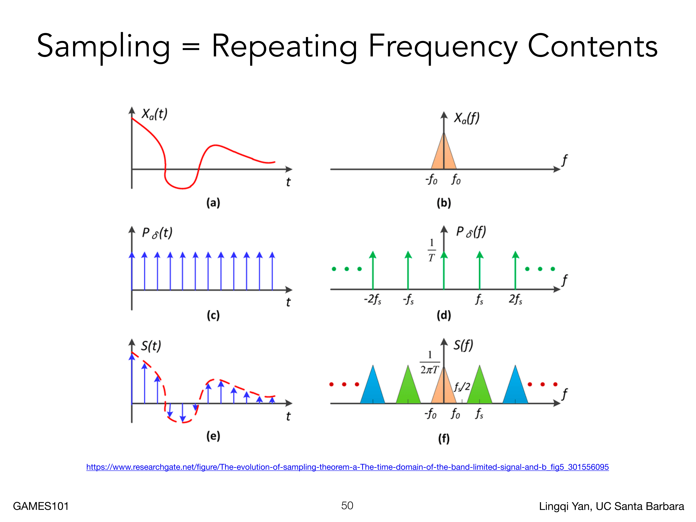

如果采样不够快，就会导致频域的混叠

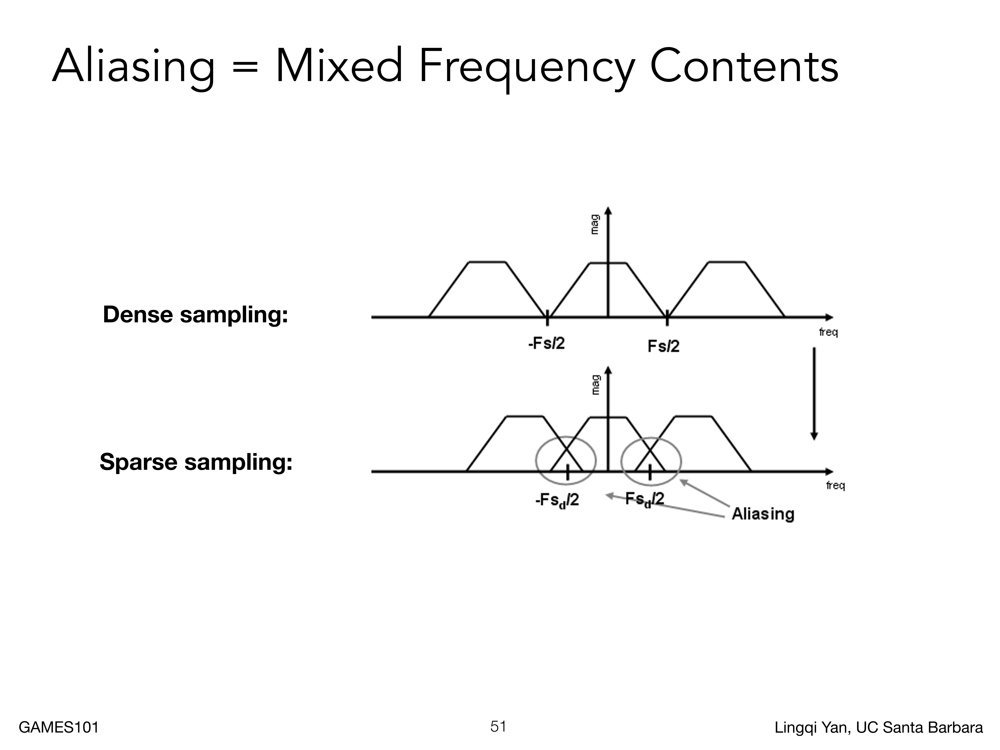

## 反走样方法

1. 增大采样率
   - 这是一个终极解决方法，比如说换一个更高分辨率的显示器
   - 需要更高分辨率，并且计算量更大
   - 这样，频谱上间隔大，就不容易混叠
2. 反走样
   - 先模糊，后采样；先剔除高频，然后采样

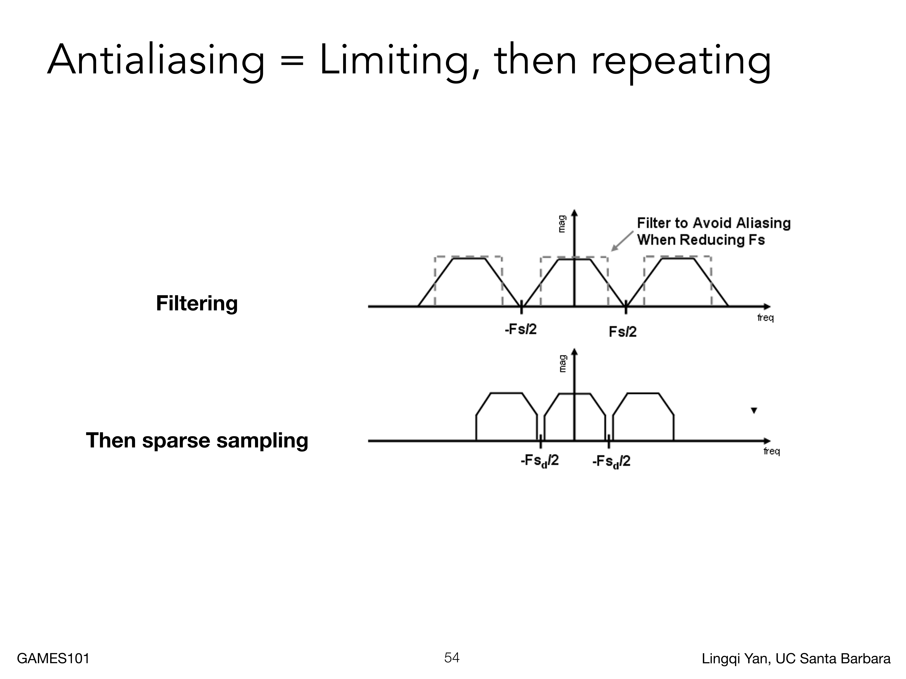

在实际操作上，我们使用什么滤波器完成模糊操作呢