# 遮挡（Visibility ）

光栅化的作用就是将三角形画在屏幕上，但是面对一系列的三维空间中的三角形，如何将其画在屏幕上并且保持一个遮挡关系呢，解决方法就是深度缓存

## 画家算法

一个三维空间的场景下有很多物体，我们想将这些放在屏幕上，那么必定有一个顺序，或者说存在遮挡的问题，那么如何在屏幕上显示这个效果呢，一个方法就是先显示远处物体，然后将近处的物体覆盖上去，逐渐从远到近完成这个结果，以前的油画就是这样完成的，这种方法也被叫做**画家算法（Painter's Algorithm）**，思想就是新物体可以覆盖旧物体

其名称来源于现实世界中画家绘画的过程，画家在创建一幅画作时，会从后向前绘制，较远的物体会先被画出，然后再画出较近的物体，这样较近的物体就覆盖了较远的物体。

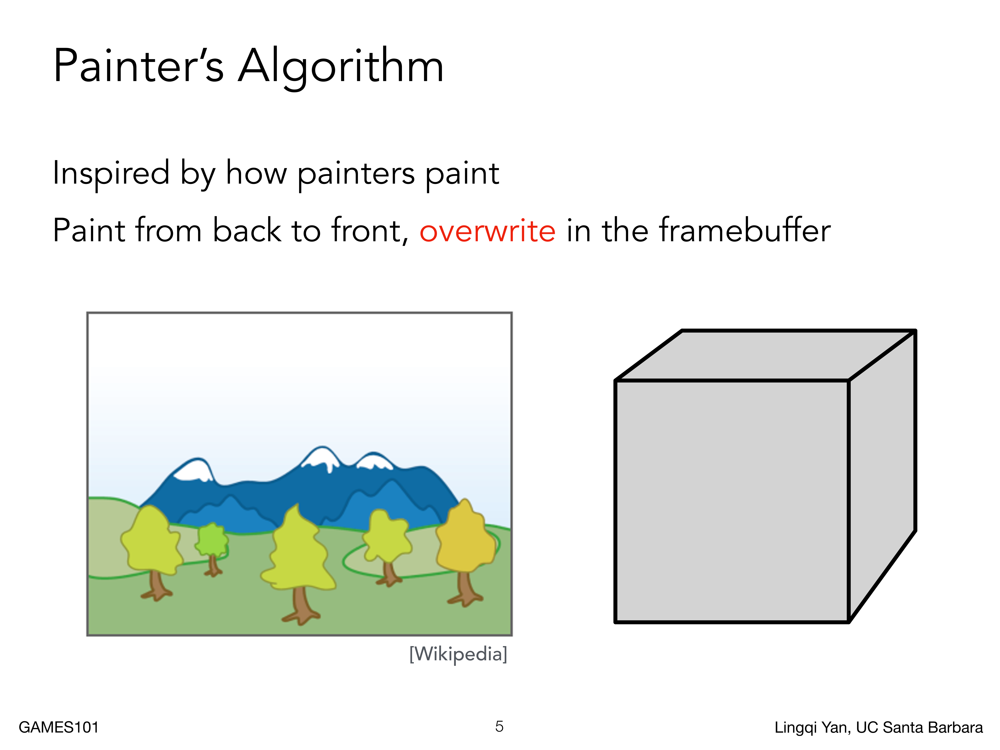

画家算法在一些情况下是适用的，但是对于一些复杂的情况，是无法完成正常显示的，比如说下图之中的互相遮挡的情况，画家算法就无法完成排序的显示，所以无法实际应用

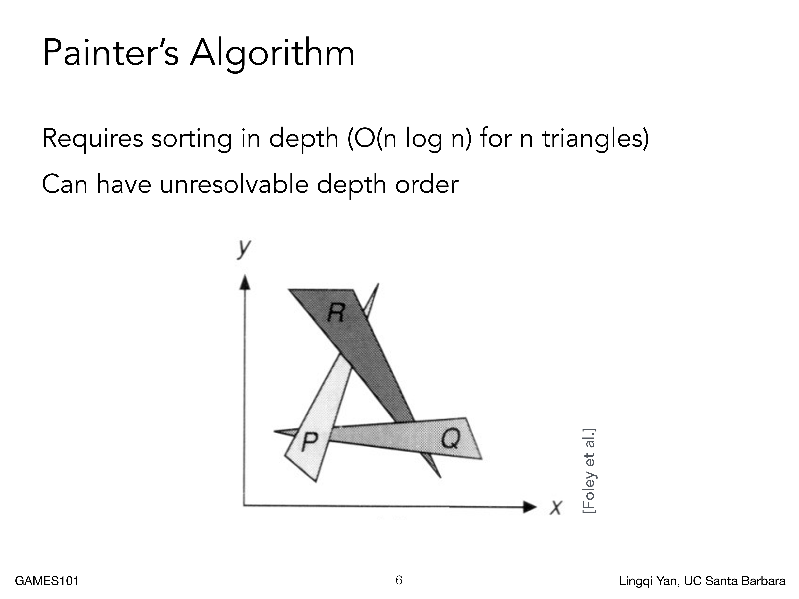

## 深度缓存（Z-Buffer）

为了解决上面的问题，人们找到了其他的方法，也就是深度缓存（也叫深度缓冲），也就是Z-Buffer，这个算法目前应用广泛

面对空间中的三角形，想对其排序是很困难的，但是对像素进行排序是很容易的，我们可以逐个像素去判断能否看到不同的三角形或者三角形的部分，就可以在这个像素内永远地记录这个像素所表示的几何的最浅的深度

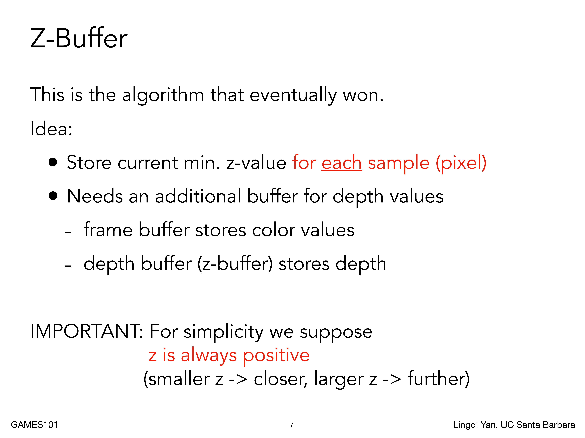

我们会渲染最后的成品图像，在生成这个图像的同时，我们也可以去生成另一个图像，这个图像会储存每个像素所看到的最浅的物体的深度信息，这个称为深度缓存

不过，前面我们规定，相机总是从原点往-Z方向看的，所以这里更远的物体Z轴坐标更小，这里为了简化计算，我们认为深度总是正的

我们可以看一下深度缓存的例子（下图所示），左边是需要渲染出的最终图像，右边是深度图，二者是一起生成的

每个物体都由许多三角形组成，每个三角形又有许多像素组成，我们盯着一个像素看，比如说地板上的一个小三角形（这个三角形在最后是要被遮挡的），它有可能覆盖要显示的像素，我们就会把地板在这个点对应的深度记录，然后再把物体放上去，并且我们发现在这个像素的位置上物体会覆盖这个地板（或者说深度更小），那么意味着物体会遮挡住地板，就需要更新这个像素的深度

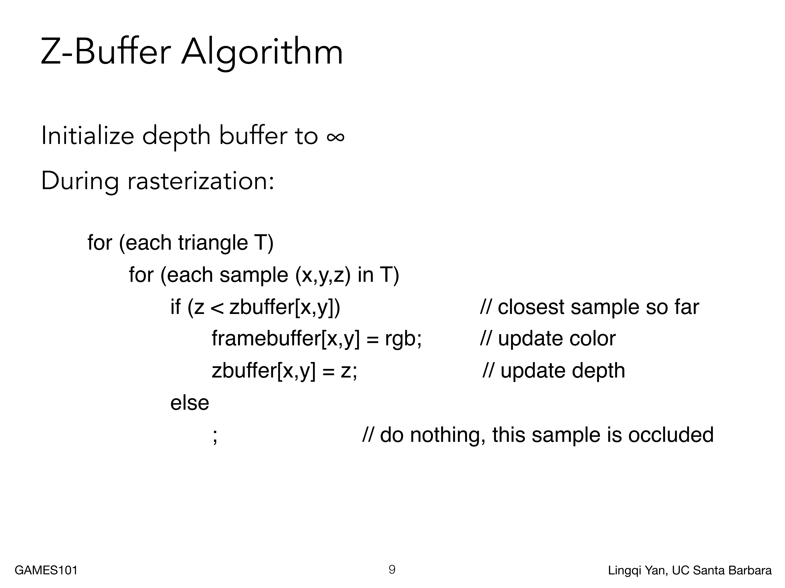

深度缓存的算法如上图所示，核心思想就是每个像素内存储最浅深度，那么可以通过两个循环完成操作

首先我们遍历所有的三角形，因为三角形可以光栅化为像素

每个三角形，如果想要画在像素内，那么其深度就应该小于记录的深度

- 初始化所有的深度缓存，认为它们的深度是无限远的
- 对于每个三角形，执行操作
  - 对于三角形中的采样点(x,y,z)或者说像素
    - 如果其深度小于记录的深度
      - 重新记录

如下图所示，我们认为最开始的深度都是无限大的（R字符代表无限远），然后先计算红色三角形的像素，然后更新，更新完红色三角形后，再计算新的三角形，维护逐像素的深度，得到最终的深度图

在这里，也可以对两种算法的复杂度进行分析，深度缓存算法实际上只不过是在遍历求最小值，没有一个排序的操作，或者说和顺序无关

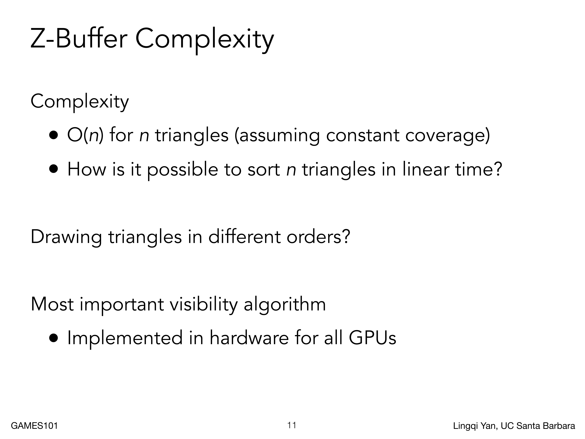

同时我们假设不会出现两个三角形在同一个像素的深度一样的情况，这个假设是有一定道理的，因为我们使用浮点型计算和表示的，我们很难去比较两个浮点型是否相等，或者说可以认为两个浮点型数值永远不会相等

总的来说，深度缓存是目前最重要的遮挡算法

# 着色（Shading）

## 问题

目前，我们已经学了投影、光栅化和遮挡这些概念了

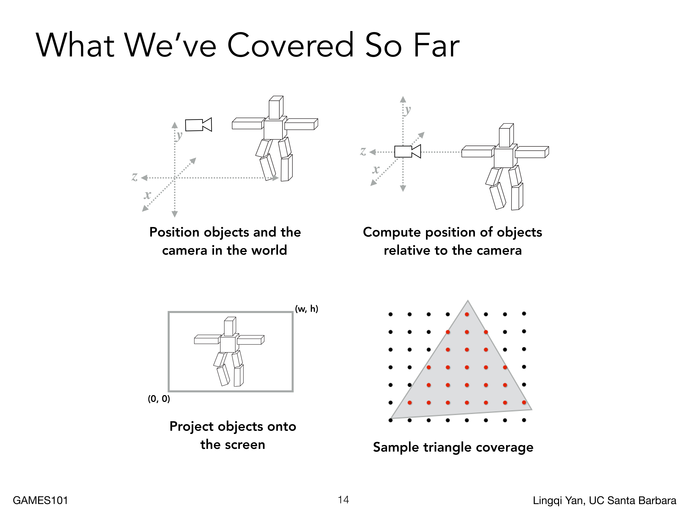

这样可以得到一些显示结果（下图所示），但是也会有一些视觉上的问题，比如说下图中的立方体矩阵，就会在显示上有视觉错觉，让人类大脑无法正确处理

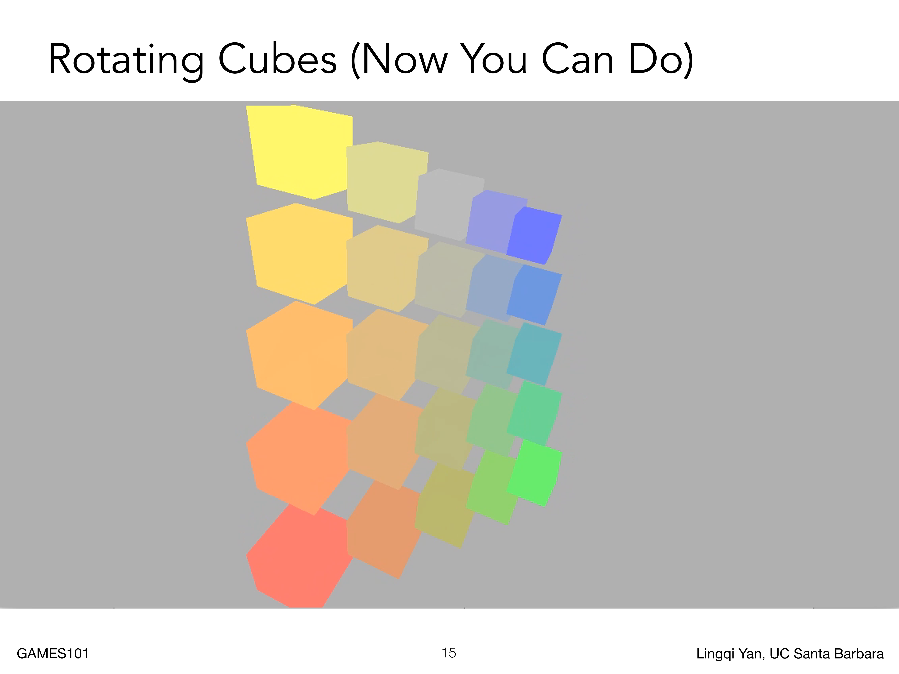

我们期望看到的是下图这种情况，每个面的颜色略有不同，显示的更真实，这也是着色问题

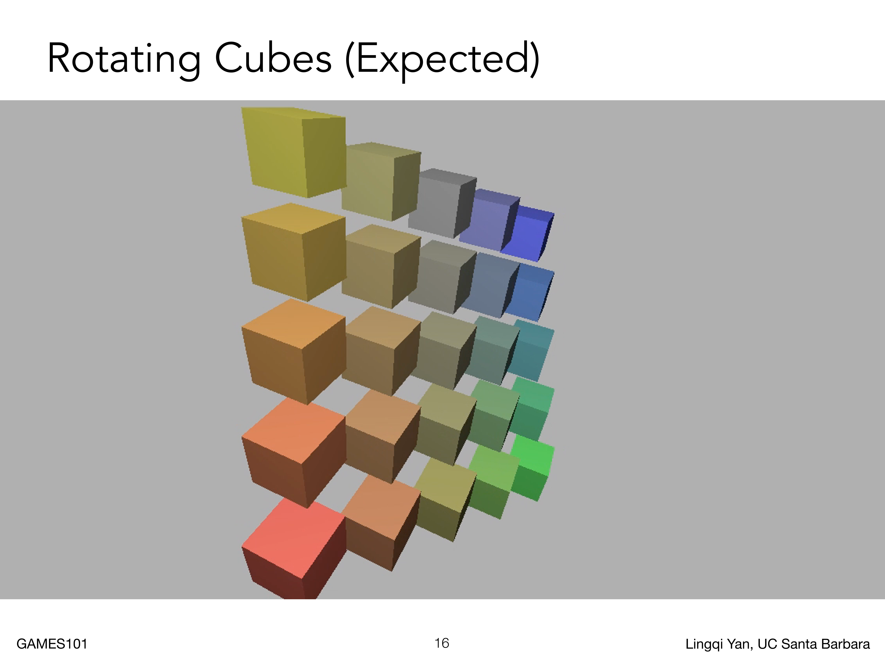

## 概念

"着色"是一个重要的概念，会引入明暗的不同和颜色的不同，它涉及如何在图形渲染过程中为像素（或更准确地说，为图形的表面）分配颜色。着色过程的目标是创建出逼真的图像，这通常需要模拟真实世界中的光照条件和物体表面的属性。或者说，着色就是一个对物体应用不同材质的过程

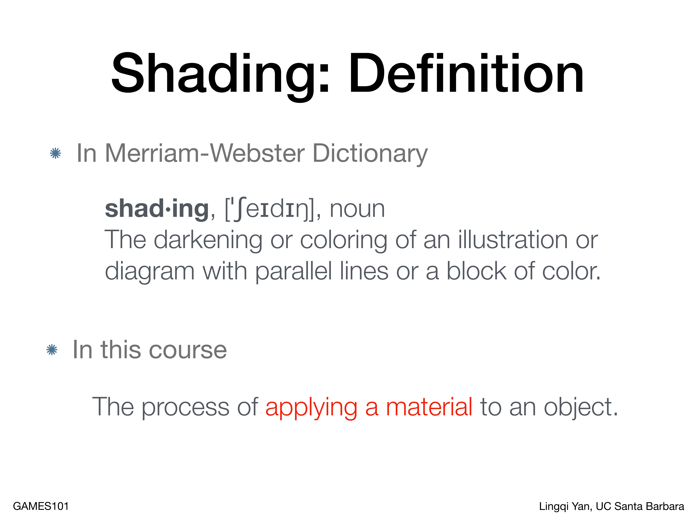

我们可以看一下一个简单的例子，光线照射到不同的茶杯上，我们可以在某些地方看到镜面高光（Specular highlights）和环境光照（Ambient lighting）

还有的地方，没有接收到光，但是还是可以看到颜色的，因为物理上，物体只有反射或者发出光线才可以被看到，这里可以看到没有接受的光线的地方，是因为除了直接光照外，还有间接光照（比如说桌面反射的光线照射到杯子上）

在研究光照之前，需要定义一些基础概念

我们考虑光照，是考虑每个点上的光照，或者说考虑一个Shading Point的光照（如下图所示），每个着色点在物体表面上，尽管不同的物体会有不同的形状，但是我们认为在一个局部的很小的范围内，这个着色点的表面就是平面，然后可以在这里定义法线$\vec{n}$，观测方向$\vec{v}$和光照方向$\vec{l}$，这些方向向量都是单位向量，然后还有一些表面参数，形容物体表面的一些属性（颜色和亮度等）

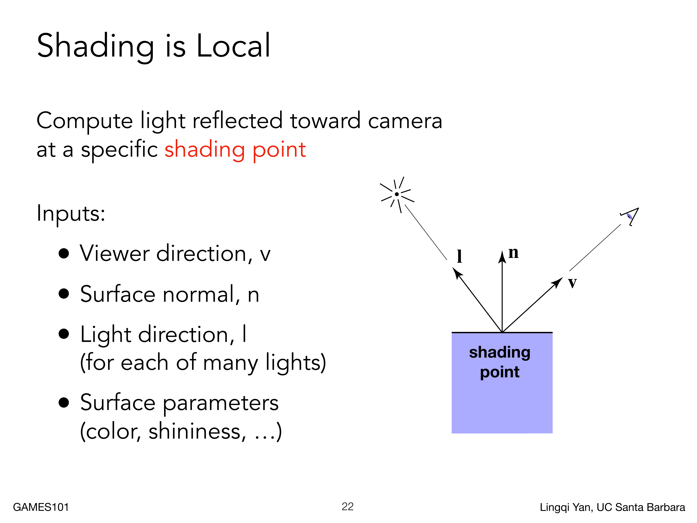

着色不考虑这个点是否在阴影内，我们只看着色点自己，不考虑其他物体的存在，或者说不考虑影子，所以说着色是局部概念，不显示阴影，只考虑明暗

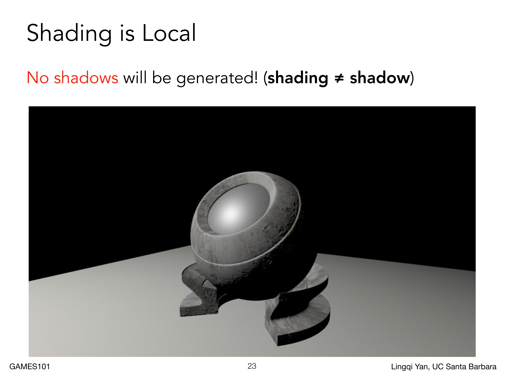

我们从漫反射开始考虑，一束光打到一个着色点上，会被往各个方向反射，如下图所示

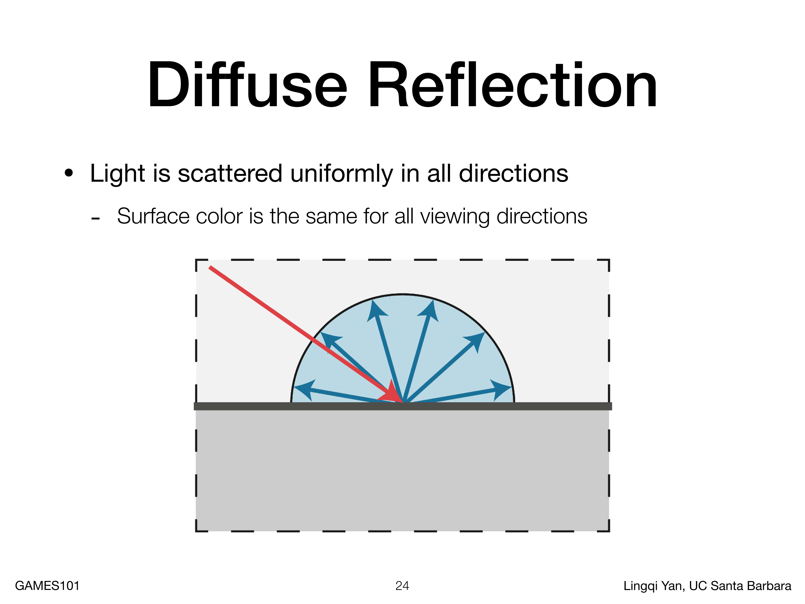